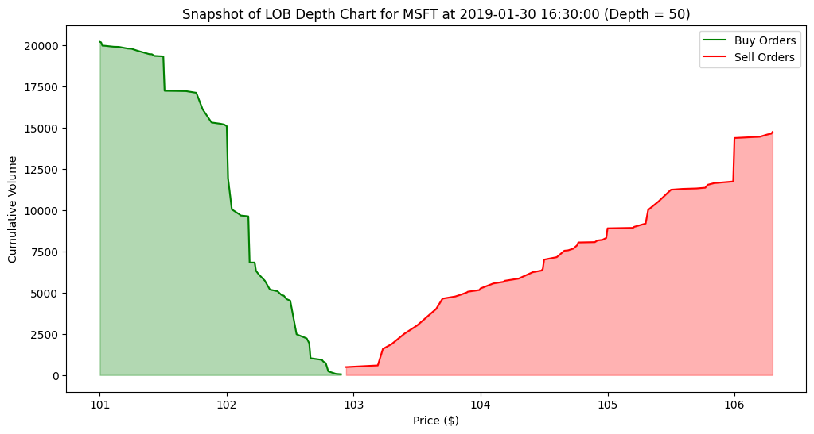

# ITCH 5.0 Order Book Reconstruction

## Overview 
An implementation of a parser and order book reconstruction for NASDAQ TotalView-ITCH 5.0; the intent was to familiarize myself with structure of limit orderbooks. The raw ITCH data comes in binary and is parsed according to these [specifications](https://www.nasdaqtrader.com/content/technicalsupport/specifications/dataproducts/NQTVITCHSpecification.pdf)); I downloaded the sample data from [here](https://emi.nasdaq.com/ITCH/Nasdaq%20ITCH/); the file I used was ```01302019.NASDAQ_ITCH50```. 

## Components
- parse_itch5.py: Parses raw ITCH messages, extracting relevant information from binary format.
- orderbook.py: Constructs and manages the order book, updating it with data from parsed ITCH messages.
- reconstruct.py: Integrates the parsing logic and order book structure to rebuild the LOB from ITCH data.
- notebooks/example_visualization.ipynb: Example visualization of reconstructed order book and trade history for MSFT (on 2019-01-30).
  
The ```reconstruct_orderbook``` function in reconstruct.py will iterate through the data and return a list of orderbooks, each of which contain a orderbook history and a trade history (updated per message when relevant); they can be saved as csvs by using the ```export_to_csv``` function.

## Implementation Details

I implemented the limit order book with a sorted dictionary (self-balancing BST, e.g. a red black tree) of bids and asks, alongs with a dictionary (hashmap) of orders. This gives us worst case $\mathcal O(\log n)$ time for insertion/deletion, and $\mathcal O(1)$ time for lookup by order id; in particular, we also have $\mathcal O(1)$ access to max bid and min ask. As I understand it, this structure is not really used in practice, where further considerations demand different data structures: one must consider the distribution of events,  the sparsity of price levels for the asset class, the peculiarities of the datafeed, the hardware which is being used (i.e you probably want something more cache friendly). Here is a great [post](https://quant.stackexchange.com/questions/63140/red-black-trees-for-limit-order-book) on this topic. 

Though, I think for a *matching engine* (which this is not), something like a red black tree seems like a reasonable/natural choice, as price time priority is in-built.

## Installation and Usage
For installation, clone the repository and install the required packages using pip:
```bash
pip install -r requirements.txt
```
Then adjust the parameters in reconstruct.py and run it:
```bash 
python reconstruct.py
```
##


